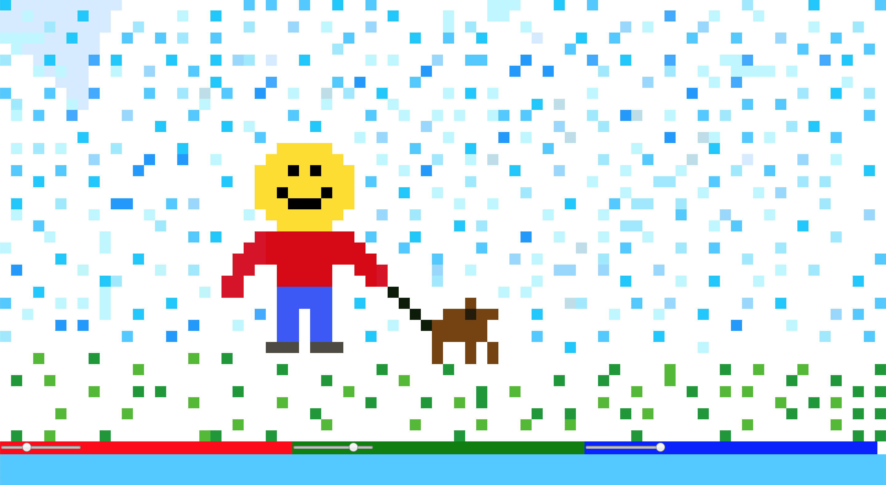
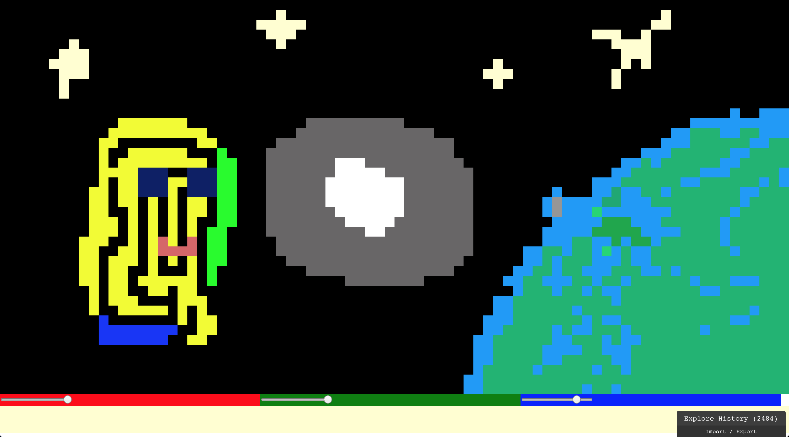
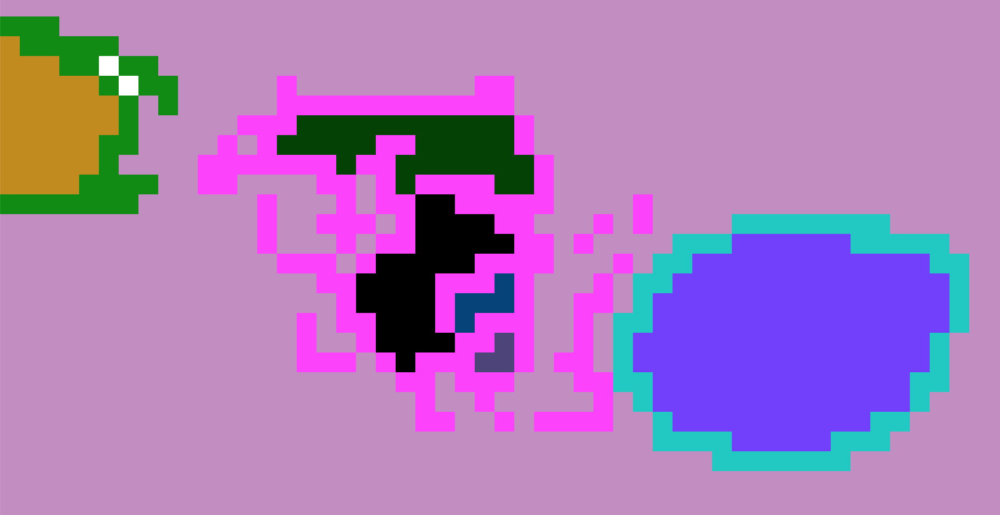

# PixElm

Pixel editor in Elm with flood fill and pencil drawing modes, in 250 loc

## Usage

Click and drag to draw with a pencil

Click to flood fill

Adjust current color with the sliders below

## Building

You will need to have Elm installed. Run `build.sh` to build the whole app, then run `elm-reactor` and go to `localhost:8000/index.html` to run it locally.

Or just head over to [vitez.me/pixelm](http://vitez.me/pixelm)

## Screenshots

